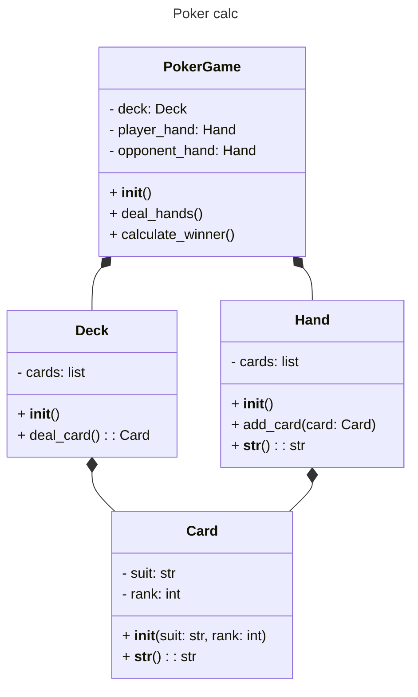

# POKER CALCULATION

```mermaid
---
title: Poker calc
---
classDiagram
  class PokerGame {
    - deck: Deck
    - player_hand: Hand
    - opponent_hand: Hand
    + __init__()
    + deal_hands()
    + calculate_winner()
}

class Deck {
    - cards: list
    + __init__()
    + deal_card(): Card
}

class Hand {
    - cards: list
    + __init__()
    + add_card(card: Card)
    + __str__(): str
}

class Card {
    - suit: str
    - rank: int
    + __init__(suit: str, rank: int)
    + __str__(): str
}

PokerGame *-- Deck
PokerGame *-- Hand
Deck *-- Card
Hand *-- Card
```
