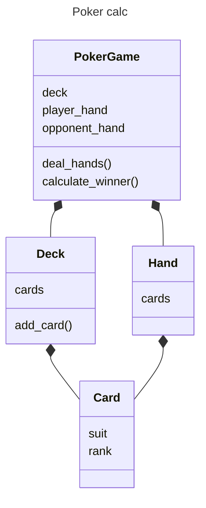

# POKER CALCULATION

```mermaid
---
title: Poker calc
---
classDiagram
  class PokerGame {
    deck
    player_hand
    opponent_hand
    deal_hands()
    calculate_winner()
}

class Deck {
    cards
    add_card()
}

class Hand {
    cards
}

class Card {
    suit
    rank
}

PokerGame *-- Deck
PokerGame *-- Hand
Deck *-- Card
Hand *-- Card
```
