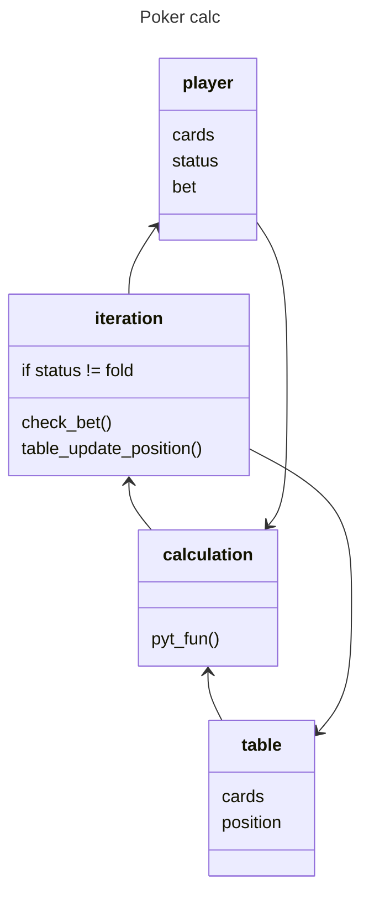

# POKER CALCULATION

```mermaid
---
title: Poker calc
---
classDiagram
    class player {
        cards
        status
        bet
    }

    class table {
        cards
        position
    }

    class calculation {
       pyt_fun()
    }
    class iteration{
        check_bet()
        if status != fold
        table_update_position()
    }
    player <-- iteration
    table <-- iteration
    calculation <-- player
    calculation <-- table
    iteration<-- calculation
```
